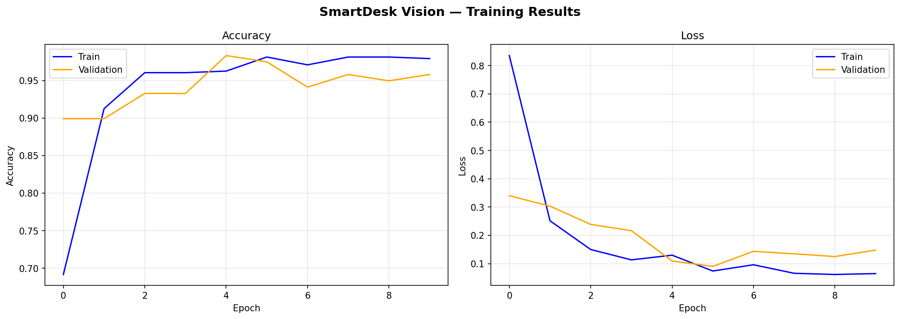

# SmartDesk Vision — AI-Powered IoT Object Detection System

A real-time desk object detection system built from scratch using Computer Vision, Deep Learning, and IoT integration. The system detects objects through a webcam, logs every detection to a database, streams live video to a browser dashboard, and displays analytics — all running locally as a complete end-to-end pipeline.

---

## What It Does

Point a webcam at your desk and the system identifies objects in real time, draws bounding boxes with confidence scores, logs each detection with a timestamp, and displays everything on a live glassmorphism web dashboard — including charts, detection history, and a screenshot gallery.

---

## Features

- Real-time object detection via webcam with bounding boxes and FPS counter
- MobileNetV2 Transfer Learning model trained on a custom dataset — **98.32% validation accuracy**
- Live video stream embedded directly in the browser dashboard
- Detection logging to SQLite database with timestamp and confidence score
- REST API with 9 endpoints serving the dashboard
- Bar chart and pie chart showing detection distribution — both visible without scrolling
- Detection history table with CSV export
- Screenshot capture saved to a local gallery with download option
- Glassmorphism dark UI with 5 sidebar navigation pages
- Auto-refreshing live feed every 3 seconds

---

## Tech Stack

| Layer | Tools |
|-------|-------|
| AI / ML | TensorFlow 2.21, Keras, MobileNetV2 |
| Computer Vision | OpenCV 4.13 |
| Backend | Flask 3.0, Flask-CORS, SQLite |
| Frontend | HTML5, CSS3, JavaScript, Chart.js |
| Training | Jupyter Notebook, Anaconda |
| Data Collection | DuckDuckGo Search API (ddgs) |

---

## Detected Objects

| Object | Confidence Threshold |
|--------|---------------------|
| Mouse | 90% |
| Keyboard | 90% |
| Phone | 90% |
| Charger | 90% |

---

## Model Details

| Detail | Value |
|--------|-------|
| Architecture | MobileNetV2 + custom classification head |
| Pretrained Weights | ImageNet |
| Training Images | 150 per class, 600 total |
| Validation Split | 20% |
| Best Validation Accuracy | **98.32%** |
| Epochs Run | 10 (Early Stopping at Epoch 10, best at Epoch 5) |
| Input Size | 224 × 224 px |
| Output Classes | 4 |

---

## Project Structure

```
SmartDesk-Vision/
├── templates/
│   ├── dashboard.html        # Glassmorphism web dashboard
│   └── login.html            # Login page
├── static/
│   ├── style.css             # All dashboard styling
│   └── script.js             # API calls, charts, live feed
├── dataset/
│   ├── mouse/                # 150 training images
│   ├── keyboard/             # 150 training images
│   ├── phone/                # 150 training images
│   └── charger/              # 150 training images
├── screenshots/              # Captured webcam screenshots
├── app.py                    # Flask backend + video streaming
├── detect.py                 # AI detection engine
├── train_model.ipynb         # Full training pipeline notebook
├── download_images.ipynb     # Dataset collection notebook
├── model.h5                  # Trained model weights
├── class_names.json          # Class label mapping
├── requirements.txt          # All dependencies
├── training_results.png      # Accuracy and loss curves
└── detections.db             # SQLite database (auto-created)
```

---

## Getting Started

### Requirements

- Python 3.10+
- Anaconda
- Webcam

### Installation

```bash
git clone https://github.com/fatima-athar08/SmartDesk-Vision.git
cd SmartDesk-Vision
pip install -r requirements.txt
```

### Run

```bash
python app.py
```

Then open your browser at:

```
http://127.0.0.1:5000
```

The webcam starts automatically. Detection, logging, and streaming all begin immediately.

---

## API Endpoints

| Method | Endpoint | Description |
|--------|----------|-------------|
| GET | `/` | Serves the dashboard |
| GET | `/video_feed` | Live MJPEG webcam stream |
| POST | `/log` | Log a detection to database |
| GET | `/detections` | Get all logged detections |
| GET | `/detections/latest` | Get last 10 detections |
| GET | `/stats` | Detection counts per class |
| GET | `/capture` | Capture and save a screenshot |
| GET | `/screenshots` | List all saved screenshots |
| DELETE | `/detections` | Clear all detection records |

---

## Dashboard Pages

| Page | What It Shows |
|------|--------------|
| Dashboard | Stat cards, bar chart, pie chart, live feed, system status |
| Live Feed | Webcam stream with bounding boxes + detection list side by side |
| Detections | Full history table with export CSV and clear options |
| Analytics | Dedicated full-page charts |
| Screenshots | Gallery of all captured frames with download option |

---

## Training Results

Trained using Transfer Learning — MobileNetV2 base frozen, custom Dense + Dropout layers on top.

- Accuracy climbed from 69% to 98.32% over 10 epochs
- No overfitting — train and validation curves stayed close throughout
- Early stopping restored best weights from Epoch 5



---

## How It Works

```
Webcam frame captured by OpenCV
           ↓
Resized to 224×224 and normalized
           ↓
Passed through MobileNetV2 model
           ↓
Class predicted with confidence score
           ↓
Bounding box + label drawn on frame
           ↓
Detection logged to SQLite via Flask API
           ↓
Frame streamed to browser as MJPEG
           ↓
Dashboard auto-refreshes charts and feed
```

---

## Requirements

Full list in `requirements.txt`. Main ones:

```
Flask==3.0.0
tensorflow==2.21.0
opencv-python==4.13.0.92
flask-cors==6.0.2
numpy
pillow
requests
```

---

## Future Improvements

- Add YOLOv8 for multi-object detection in a single frame
- Deploy on Raspberry Pi with Pi Camera module
- Add email or SMS alert when a specific object is detected
- Extend to more object classes
- Add user authentication (login page already included)

---

## Author

**Fatima Athar**
BS Information Technology — University of Agriculture Faisalabad
Specialization: AI/ML, Computer Vision, Full Stack Development

[](https://github.com/fatima-athar08)
